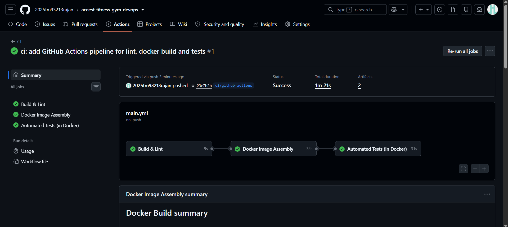
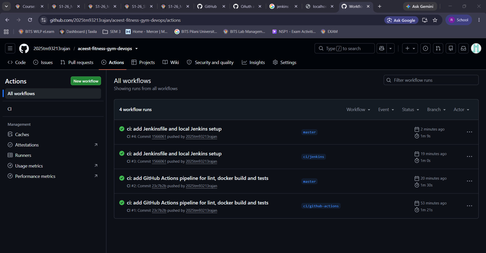
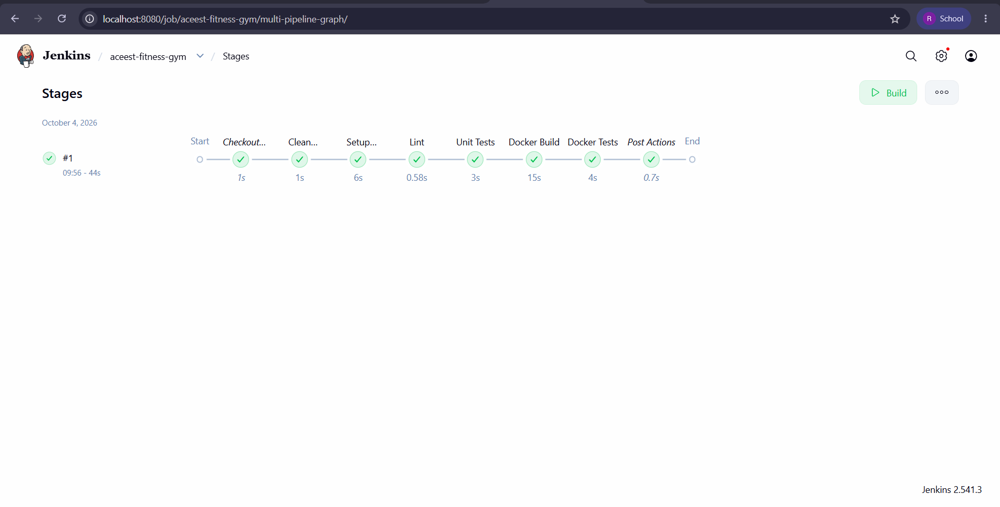
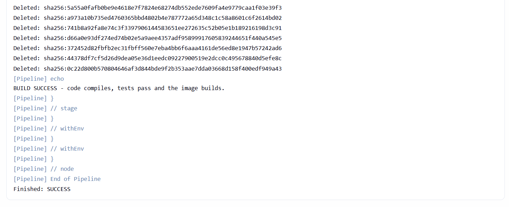

# ACEest Fitness & Gym - DevOps CI/CD Project

[](https://github.com/2025tm93213rajan/aceest-fitness-gym-devops/actions/workflows/main.yml)

A Flask REST service for gym and client management, delivered through an automated
pipeline: Git/GitHub for version control, Pytest for validation, Docker for packaging,
and GitHub Actions + Jenkins for continuous integration.

The service started life as a set of Tkinter desktop prototypes (kept in [`legacy/`](legacy/)).
Their business rules - training programs, calorie estimates, BMI, weekly adherence,
workouts and membership - were ported into a testable web API.

## Contents

- [Project structure](#project-structure)
- [Local setup and execution](#local-setup-and-execution)
- [Running the tests manually](#running-the-tests-manually)
- [Running with Docker](#running-with-docker)
- [API reference](#api-reference)
- [CI/CD overview](#cicd-overview)
- [Jenkins setup](#jenkins-setup)
- [Git workflow](#git-workflow)
- [Pipeline evidence](#pipeline-evidence)

## Project structure

```
.
├── app.py                  # entry point (flask run / gunicorn app:app)
├── aceest/
│   ├── __init__.py         # application factory
│   ├── db.py               # SQLite connection + schema
│   ├── routes.py           # REST endpoints
│   └── services.py         # business rules + input validation (pure functions)
├── tests/                  # pytest suite
├── Dockerfile              # multi-stage: builder / test / runtime
├── Jenkinsfile             # Jenkins BUILD pipeline
├── jenkins/                # Dockerfile + compose file for a local Jenkins server
├── .github/workflows/main.yml   # GitHub Actions pipeline
├── legacy/                 # original Tkinter versions v1.0 - v3.2.4
├── requirements.txt        # runtime dependencies
└── requirements-dev.txt    # + pytest, pytest-cov, flake8
```

## Local setup and execution

Requirements: Python 3.12+ and Git.

```bash
git clone https://github.com/2025tm93213rajan/aceest-fitness-gym-devops.git
cd aceest-fitness-gym-devops

# create and activate a virtual environment
python -m venv .venv
source .venv/bin/activate          # Windows: .venv\Scripts\activate

pip install -r requirements.txt
python app.py
```

The API is now available at <http://localhost:5000>. Quick check:

```bash
curl http://localhost:5000/health
curl http://localhost:5000/programs
```

The SQLite database file is created automatically (`aceest_fitness.db` in the working
directory). Set the `ACEEST_DB` environment variable to store it somewhere else.

## Running the tests manually

```bash
pip install -r requirements-dev.txt

# run the suite
python -m pytest

# with a coverage report
python -m pytest --cov=aceest --cov-report=term-missing

# style / syntax checks (same ones the pipelines run)
python -m compileall -q app.py aceest tests
flake8 .
```

The tests use a temporary SQLite database per test, so they never touch real data.
Current state: **77 tests, 100% coverage** of the `aceest` package.

| File | What it covers |
|------|----------------|
| `tests/test_services.py` | calorie formula, BMI value + category boundaries, membership status, date helpers, validation rules |
| `tests/test_api.py` | every endpoint, including 400 / 404 / 409 / 422 error paths and cascading delete |

## Running with Docker

```bash
# build the runtime image
docker build -t aceest-fitness .

# run it (named volume keeps the database between restarts)
docker run -d --name aceest -p 5000:5000 -v aceest-data:/data aceest-fitness

curl http://localhost:5000/health
```

Run the test suite inside a container (this is what both pipelines do):

```bash
docker build --target test -t aceest-fitness:test .
docker run --rm aceest-fitness:test
```

About the image:

- Multi-stage build - the final image only contains the virtualenv and the application code,
  no pip cache, no test tooling (~145 MB on `python:3.12-slim`).
- Runs as a non-root user (`appuser`) and serves with gunicorn.
- Dependencies are installed before the source is copied, so code-only changes reuse the cache.
- Built-in `HEALTHCHECK` against `/health`.

## API reference

Program codes: `FL` (Fat Loss), `MG` (Muscle Gain), `BG` (Beginner).

| Method | Endpoint | Description |
|--------|----------|-------------|
| GET | `/health` | liveness check |
| GET | `/programs` | list programs and their calorie factors |
| GET | `/programs/<code>` | workout and diet plan for a program |
| POST | `/clients` | create a client (`name` and `program` required) |
| GET | `/clients` | list clients |
| GET | `/clients/<name>` | get one client |
| PUT | `/clients/<name>` | update a client (partial updates allowed) |
| DELETE | `/clients/<name>` | delete a client and their history |
| GET | `/clients/<name>/calories` | daily calories = weight x program factor |
| GET | `/clients/<name>/bmi` | BMI value and category |
| GET | `/clients/<name>/membership` | Active / Expired / Inactive and days left |
| POST, GET | `/clients/<name>/progress` | log / list weekly adherence (0-100) |
| POST, GET | `/clients/<name>/workouts` | log / list workouts |
| POST, GET | `/clients/<name>/metrics` | log / list weight, waist, body-fat |

Example:

```bash
curl -X POST http://localhost:5000/clients \
  -H "Content-Type: application/json" \
  -d '{"name": "Asha Rao", "program": "FL", "age": 28, "height": 165, "weight": 70}'

curl http://localhost:5000/clients/Asha%20Rao/calories
# {"calories":1540,"client":"Asha Rao","program":"FL","weight":70.0}
```

Errors are returned as JSON: `400` for invalid input (with a list of messages), `404` for
unknown clients or programs, `409` for a duplicate client, `422` when data needed for a
calculation (e.g. height for BMI) is missing.

## CI/CD overview

Every change goes through two independent pipelines. GitHub Actions gives fast feedback on
each pull request; Jenkins repeats the build in a separate, controlled environment as a
second quality gate.

```
 developer ──push──▶ GitHub ──┬──▶ GitHub Actions  (push to master, every pull request)
                              │       Build & Lint ─▶ Docker Image Assembly ─▶ Tests in Docker
                              │
                              └──▶ Jenkins         (polls master every 5 min / manual build)
                                      Clean checkout ─▶ venv ─▶ Lint ─▶ Unit tests
                                      ─▶ Docker build ─▶ Tests in Docker
```

### GitHub Actions (`.github/workflows/main.yml`)

Triggered on pushes to `master` and on every pull request. Three chained jobs - a failure
stops the later ones:

1. **Build & Lint** - installs dependencies, byte-compiles the sources to catch syntax
   errors and runs `flake8`.
2. **Docker Image Assembly** - builds the `runtime` image with Buildx (layer cache stored in
   the GitHub Actions cache) and smoke tests it by starting the container and calling `/health`.
3. **Automated Tests (in Docker)** - builds the `test` target and runs `pytest` inside the
   container, so the tests run in the same environment the application ships in.

### Jenkins (`Jenkinsfile`)

A declarative pipeline pulls the latest code from GitHub and builds it from scratch:

| Stage | What happens |
|-------|--------------|
| Clean Checkout | workspace is wiped, then the repo is checked out - every build starts clean |
| Setup Environment | fresh virtualenv, `pip install -r requirements-dev.txt` |
| Lint | `compileall` + `flake8` |
| Unit Tests | `pytest` with coverage; the JUnit report is published in Jenkins |
| Docker Build | builds the runtime image |
| Docker Tests | builds the test image and runs the suite inside it |

The job is configured as *Pipeline script from SCM* pointing at this repository, branch
`master`. Because a local Jenkins cannot receive GitHub webhooks, it uses `pollSCM`
(every 5 minutes); builds can also be started manually with **Build Now**. Images created
by a build are removed in the `post` step.

## Jenkins setup

A ready-to-use local Jenkins (with Python and the Docker CLI baked in) is provided:

```bash
cd jenkins
docker compose up -d --build
docker exec aceest-jenkins cat /var/jenkins_home/secrets/initialAdminPassword
```

1. Open <http://localhost:8080>, paste the password and install the suggested plugins.
2. **New Item** → name `aceest-fitness-gym` → **Pipeline**.
3. Pipeline definition: **Pipeline script from SCM**
   - SCM: Git, repository URL of this repo
   - Branch specifier: `*/master`
   - Script path: `Jenkinsfile`
4. Save and click **Build Now**.

The container mounts the host Docker socket so the pipeline can build images. That is fine
for a local lab setup but should not be done on a shared server.

## Git workflow

- `master` is the stable branch and every phase of the project was built on its own
  short-lived branch, named by purpose: `feature/*`, `infra/*`, `ci/*`, `docs/*`.
- Each branch was pushed to GitHub (so it got its own Actions run) and then merged into
  `master`. From the documentation phase onwards changes are merged through pull requests.
- Commit messages follow the conventional style (`feat:`, `test:`, `build:`, `ci:`,
  `docs:`, `chore:`) with a short body explaining what changed.

| Branch | Content |
|--------|---------|
| `feature/flask-app` | Flask API |
| `feature/unit-tests` | Pytest suite |
| `infra/docker` | Dockerfile |
| `ci/github-actions` | GitHub Actions workflow |
| `ci/jenkins` | Jenkinsfile + local Jenkins setup |
| `docs/pipeline-evidence` | README corrections and pipeline screenshots (pull request) |

## Pipeline evidence

GitHub Actions - the three chained jobs passing (Build & Lint, Docker Image Assembly,
Automated Tests in Docker):



Workflow runs across the feature branches and `master`:



Jenkins - build #1 of the `aceest-fitness-gym` pipeline job (pulled from GitHub `master`),
all stages green:



End of the Jenkins console output - build finished with `SUCCESS`
(the complete log is in [`jenkins-console-full.png`](docs/images/jenkins-console-full.png)):


